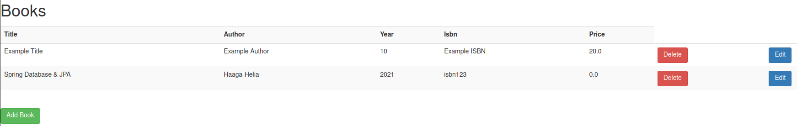

# Bookstore | Joonas Kulmala

- [Bookstore | Joonas Kulmala](#bookstore--joonas-kulmala)
  - [Project description](#project-description)
  - [Requirements](#requirements)
  - [Current features](#current-features)
    - [CRUD functionality using H2 in-mem database](#crud-functionality-using-h2-in-mem-database)
    - [REST](#rest)
  - [License](#license)

## Project description

Palvelinohjelmointi - SWD4TN020

This repository is being updated weekly. It contains the **newest** build **only**.

For previous iterations visit my other repository [Palvelinohjelmointi | Joonas Kulmala](https://github.com/JoonasKulmala/Palvelinohjelmointi).

## Requirements

`Java 11` is required.

## Current features

Run the main application file [BookstoreApplication.java](src/main/java/fi/kulmala/Bookstore/BookstoreApplication.java) and open browser at port 8080

### CRUD functionality using H2 in-mem database

CRUD functions are available at `/studentlist`

<kbd>
  
</kbd>

### REST

Rest API endpoints are available at `/api`

<kbd>
  
</kbd>

## License

Repository and all its contents distributed under [MIT](LICENSE) license.