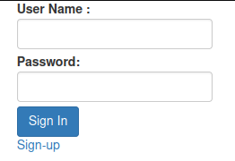
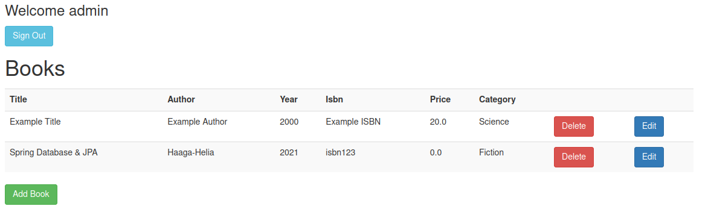
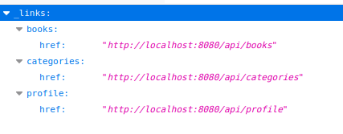

# Bookstore | Joonas Kulmala

- [Bookstore | Joonas Kulmala](#bookstore--joonas-kulmala)
  - [Project description](#project-description)
  - [Requirements](#requirements)
  - [Current features](#current-features)
    - [Authentication](#authentication)
    - [CRUD functionality](#crud-functionality)
    - [REST API](#rest-api)
  - [License](#license)

## Project description

Palvelinohjelmointi - SWD4TN020

This repository is being updated weekly. It contains the **newest** build **only**.

For previous iterations visit my other repository [Palvelinohjelmointi | Joonas Kulmala](https://github.com/JoonasKulmala/Palvelinohjelmointi).

***Live Build*** deployed via [Heroku - joonaskulmala.bookstore](https://joonaskulmala-bookstore.herokuapp.com/booklist)

## Requirements

`Java 11` is required to run this application.

Run the main application file [BookstoreApplication.java](src/main/java/fi/kulmala/Bookstore/BookstoreApplication.java) and open browser at port 8080

    localhost:8080

## Current features

### Authentication

Two users are initialized on application startup:

- user/user (role=user)
- admin/admin (role=admin)

Application has the following authentication services:

- registration
- login

<kbd>
  
</kbd>

### CRUD functionality

Navigate to main view

    localhost:8080/booklist

<kbd>
  
</kbd>

### REST API

Rest API endpoints are available at

    localhost:8080/api

<kbd>
  
</kbd>

## License

Repository and all its contents distributed under [MIT](LICENSE) license.
